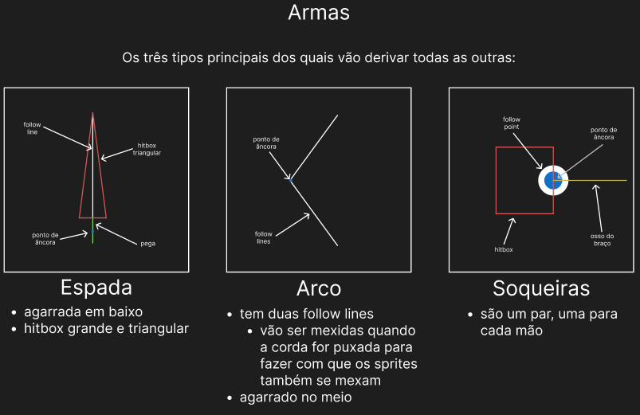
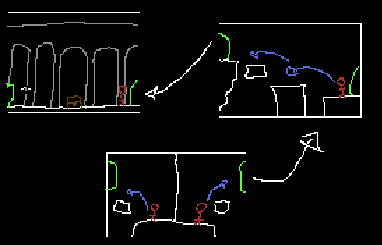

# Game design doc

# Estilo

Roguelite | Metroidvania | Dungeon Crawler | Multiplayer | Fighting.

# Ideia base

Mapa proceduralmente gerado, com formato de salas predefinidas (para ajudar na learning curve).

O jogo é de luta contra um oponente.

Ambos começam o jogo totalmente desarmados e desprotegidos tendo, assim, que ganhar itens e ficando mais fortes farmando inimigos (minions) e salteando baús ou cofres.

Os jogadores têm que lutar até à morte e o que vencer ganha um ponto.

**Melhor de 3 rondas.**

## Outras ideias

### Ideia 1 - conhecimento do mapa

> De ronda para ronda o jogador fica com a informação sobre as salas que explorou e a localização dos baús/cofres que loteou.

### Ideia 2 - desenvolvimento das batalhas

> Os jogadores têm que explorar a dungeon durante um dia inteiro e a batalha será à meia noite em ponto (in game time *5min*)
>
> Caso os jogadores se encontrem no mapa podem lutar até à morte e o que vencer ganha 1 ponto.

---

# Mecânicas

## Core mechanics

### Crafting

Encontra-se várias partes de armas que se podem juntar para fazer cada uma das armas mencinadas acima

Cada parte tem uma raridade diferente e uma habilidade

As armas também poderão levar outras modificações para ficarem mais fortes

## General mechanics

### Luta

- Golpes unarmerd
- Golpes com diversas armas de melee

### Armas

- Arcos
- Espadas
- Soqueiras
- Machados

---

# Looting

Em cada sala aparecerão baús que contém upgrades e/ou partes de armas

Os inimigos também têm uma chance de dropar estes itens

# Perks

Antes de cada jogo, o jogador escolhe 3 perks que lhe darão certas vantagens ou habilidades durante o jogo

**TBD**

---

# Tecnologia, Otimização e Algoritmos

## Mapa

O mapa é gerado através do algoritmo Wave Function Collapse que pega num conjunto de regras sobre como as diferentes salas se conectam entre si e gera um mapa com o tamanho desejado

### Salas

Começar-se-à numa sala comum (principal) e os 2 jogadores ficam sparados (podem haver várias variações)

**TAMANHO**: 30*17 tiles de 32x32

#### Estruturas e diferenças

Vão haver várias estruturas para cada bioma ou "nível"

#### Camadas

Para desenhar as salas, diferentes camadas precisam de ser tidas em conta, já que são diferentes camadas da pipeline de renderização.

- POIs
- colliders
- detalhes2
- blocos
- detalhes1
- parallax
- background

## Minions (inimigos)

Vão haver vários tipos de inimigos para farmar

### IA

Os mais comuns:
- vão seguir a direção do jogador assim que o virem
- enquanto não o virem andam para trás e para a frente na sua plataforma ou ficam quietos (dependendo do tipo de inimigo)

