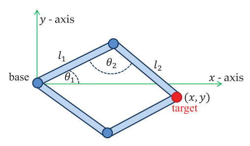

# Inverse Kinematics

Usado para animar figuras articuladas com graus de liberdade específicos usando apenas as posiçoes desejadas (e por vezes as orientações) de certas articulaçoes, normalmente referidas como "*end effectors*". Normalmente, estes *end effectors* sao pontos de controlo.

O objetivo é que os *end effectors* cheguem à posiçao desejada para completar a tarefa.

## Soluções analíticas
São métodos que tentam encontrar todas as possíveis soluções para um problema como uma funçao dos comprimentos do mecanismo, a postura inicial e as restriçoes das rotaçoes.

### Formulas para encontrar os angulos das articulaçoes

$\theta_1 = \cos^{-1}(\frac{l_1^2 + x^2 + y^2 - l_2^2}{2l_1\sqrt{x^2 + y^2}})$ ; $\theta_2 = \cos^{-1}(\frac{l_1^2 + l_2^2 - (x^2 + y^2)}{2l_1l_2})$
