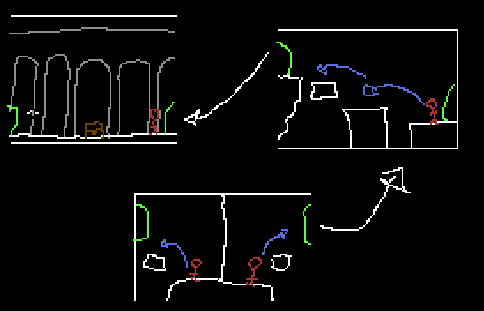

# Salas

Começar-se-à numa sala comum (principal) e os 2 jogadores ficam sparados (podem haver várias variações)

TAMANHO: 60*34 tiles de 16x16

## Estruturas e diferenças

Vão haver várias estruturas para cada bioma ou "nível"

## Camadas

Para desenhar as salas, diferentes camadas precisam de ser tidas em conta, já que são diferentes camadas da pipeline de renderização.

- POIs
- colliders
- detalhes2
- blocos
- detalhes1
- paralax
- background
